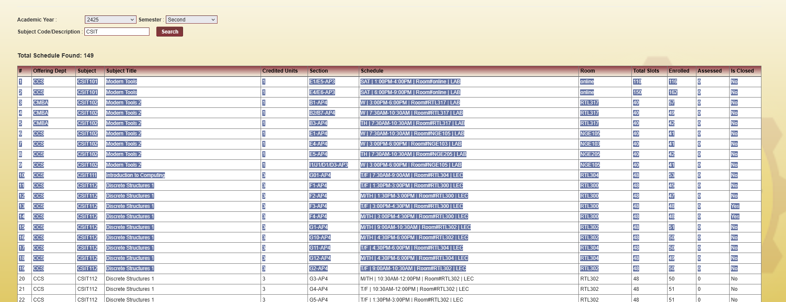
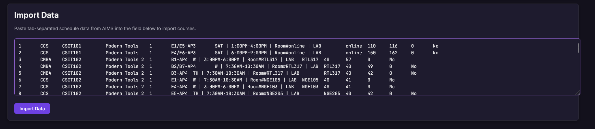

# CITU Course Builder - Usage Guide

Welcome to the CITU Course Builder! This guide will walk you through the steps to effectively plan, filter, and generate your ideal class schedule.

---

## Table of Contents

1.  [Preparing Your Course Data (AIMS Example)](#1-preparing-your-course-data-aims-example)
2.  [Importing Data into CITU Course Builder](#2-importing-data-into-citu-course-builder)
3.  [Managing Your Course List](#3-managing-your-course-list)
    *   [Viewing Courses](#viewing-courses)
    *   [Grouping Courses](#grouping-courses)
    *   [Deleting Courses](#deleting-courses)
4.  [Filtering Courses](#4-filtering-courses)
    *   [Filtering by Day and Time](#filtering-by-day-and-time)
    *   [Filtering by Section Type](#filtering-by-section-type)
    *   [Filtering by Status](#filtering-by-status)
5.  [Setting User Preferences](#5-setting-user-preferences)
    *   [Maximum Total Units](#maximum-total-units)
    *   [Maximum Allowed Gap Between Classes](#maximum-allowed-gap-between-classes)
    *   [Preferred Time of Day Order](#preferred-time-of-day-order)
    *   [Schedule Search Mode](#schedule-search-mode)
6.  [Prioritizing Courses (Locking)](#6-prioritizing-courses-locking)
7.  [Generating Your Schedule](#7-generating-your-schedule)
8.  [Viewing Your Timetable](#8-viewing-your-timetable)
9.  [Exporting Data](#9-exporting-data)
    *   [Exporting Course List](#exporting-course-list)
    *   [Exporting Timetable](#exporting-timetable)
10. [Customizing Appearance (Themes & Palettes)](#10-customizing-appearance-themes--palettes)
11. [Data Persistence](#11-data-persistence)
12. [Tips for Best Results](#12-tips-for-best-results)

---

## 1. Preparing Your Course Data (AIMS Example)

The CITU Course Builder is designed to work with tab-separated course data. For CIT-U students using the AIMS portal:

*   Navigate to the section in AIMS that lists the available courses for enlistment.
*   Select and copy the entire table data containing the course offerings. Ensure you copy all relevant columns (Subject, Section, Schedule, Units, etc.).

## 2. Importing Data into CITU Course Builder

Once you have your course data copied:

1.  Open the CITU Course Builder application in your web browser.
2.  Locate the **"Raw Data Input"** text area (usually in a dedicated "Import" section).
3.  Paste your copied course data directly into this text area.
4.  Click the **"Import Data"** button.

Your courses will now appear in the "Course List" table. The application will attempt to parse common schedule formats, including multi-line entries for a single course from AIMS.

## 3. Managing Your Course List

### Viewing Courses
The imported courses are displayed in a table with columns like Subject, Title, Units, Section, Schedule, Room, and Status.

### Grouping Courses
Above the course table, you'll find a **"Group By"** dropdown. You can group courses by:
*   **None:** Displays all courses in a flat list.
*   **Subject:** Groups courses by their subject code.
*   **Offering Department:** Groups courses by the department offering them.

### Deleting Courses
*   **Individual Course:** Click the '✕' (delete) button on the row of the course you wish to remove. A confirmation dialog will appear.
*   **All Courses:** Click the **"Delete All Courses"** button to clear your entire imported list. A confirmation dialog will appear.

## 4. Filtering Courses

Use the "Advanced Filters" section to narrow down the list of courses considered for schedule generation and display.

### Filtering by Day and Time
*   **Day Exclusion:** Check the boxes for any days of the week (e.g., "Friday") on which you do not want to have classes.
*   **Time Range Exclusion:** Define one or more time ranges (e.g., "8:00 AM - 10:00 AM" or "after 6:00 PM") to exclude courses that fall within those times.

### Filtering by Section Type
Use the checkboxes to include/exclude courses based on their section type:
*   AP3 - Online
*   AP4 - Face-to-Face
*   AP5 - Hybrid

### Filtering by Status
Use the buttons (e.g., "All Courses," "Open Only," "Closed Only") to filter courses by their enrollment status.

## 5. Setting User Preferences

Customize how the schedule generator works by adjusting settings in the "User Preferences" section.

### Maximum Total Units
Set the maximum number of units you want in your generated schedule.

### Maximum Allowed Gap Between Classes
Select the maximum break time (in hours, e.g., 1 hour, 2.5 hours) you are willing to have between classes on the same day.

### Preferred Time of Day Order
Drag and drop the time blocks (Morning, Afternoon, Evening, Any) to set your preferred order. The generator will try to prioritize schedules that match this order.

### Schedule Search Mode
Choose a schedule generation algorithm:
*   **Recommended (Flexible, Best Fit):** Aims to maximize the number of unique subjects and total units, even if not all subjects can fit. Uses an exhaustive search for smaller datasets or a heuristic for larger ones.
*   **Full Coverage (All Subjects, Strict):** Only generates schedules if one section for *every* available subject can fit within your constraints. Can be slow for many subjects.
*   **Quick (Fast, May Miss Best):** Uses a randomized heuristic to find a schedule quickly, but it may not be the absolute best possible combination.

## 6. Prioritizing Courses (Locking)

If there are specific course sections you absolutely must have in your schedule:

1.  Find the course in the "Course List" table.
2.  Click the **"Lock"** button on that course's row.
    *   The course will be marked as locked, and its `isLocked` status will change.
    *   Locked courses are always included in the Timetable View.
    *   If locking a course creates a time conflict with another already locked course, you will see visual conflict highlighting (e.g., a red border or background on the conflicting rows). You may also be prompted with a confirmation dialog indicating the specific conflicting courses.
3.  To unlock a course, click the **"Unlock"** (or "Unlock ⚠️" if in conflict) button.
4.  You can clear all locks using the **"Clear All Locks"** button (a confirmation will be required).

## 7. Generating Your Schedule

After importing courses, applying filters, setting preferences, and locking any essential sections:

1.  Click the **"Generate Best Schedule"** (or similarly named) button.
2.  The button will indicate a loading state (e.g., "Generating...").
3.  The application will use your selected "Schedule Search Mode" and all current settings to find valid, conflict-free schedules.
4.  **Results:**
    *   If successful, the generated schedule's courses will be automatically locked, and the "Course List" and "Timetable View" will update. You'll typically receive a toast notification. The generate button might update to show how many schedules were found (e.g., "Generate Schedule (1 of Y found)") and offer "Next Best" / "Previous Best" options if multiple are found.
    *   If no schedule can be found matching your criteria, an error toast notification will appear.
5.  You can click **"Reset Schedule Generator"** to clear the currently generated schedule (unlocking its courses) and try again with different settings.

## 8. Viewing Your Timetable

The **"Timetable View"** section displays a weekly grid (typically 7:00 AM to 10:00 PM) showing all your currently **locked** courses.
*   Each course entry will show details like subject, section, and room.
*   The timetable is responsive and will adapt to different screen sizes.
*   You can toggle the visibility of the full timetable. When hidden, a summary (total units, subjects, locked courses) might be shown.

## 9. Exporting Data

### Exporting Course List
You can export your current list of imported courses for backup or re-import:
1.  Locate the hamburger menu icon (☰) in the "Course List" section.
2.  Click the menu to reveal options:
    *   **'Copy Raw Data to Clipboard':** Copies your course data (transformed back into tab-separated format) to your clipboard.
    *   **'Download Raw Data as .txt':** Downloads a `course_list_export.txt` file containing your course data in tab-separated format.

### Exporting Timetable
You can export your currently displayed timetable view for sharing or printing:
1.  Locate the hamburger menu icon (☰) in the "Timetable View" section.
2.  Click the menu to reveal options:
    *   **'Export Timetable as PNG':** Downloads a `timetable_export.png` image of your current timetable.
    *   **'Export Timetable as PDF':** Downloads a `timetable_export.pdf` document containing an image of your current timetable.

## 10. Customizing Appearance (Themes & Palettes)

*   **Light/Dark Mode:** Look for a theme toggle button (often an icon like a sun/moon) to switch between light and dark modes instantly.
*   **Color Palettes:** A separate button may allow you to switch between 'Original' and 'Comfort' color palettes for the currently selected theme.

## 11. Data Persistence

All your imported course data, locked courses, filter settings, user preferences, theme, and palette choices are automatically saved in your browser's `localStorage`. This means you can close the application and when you reopen it, your previous state will be restored.

## 12. Tips for Best Results

*   **Start Broad, Then Narrow:** Import all potential courses first. Then, use filters and preferences to narrow down options before generating.
*   **Lock Only Essentials:** Only lock courses you absolutely cannot change. Locking too many courses can severely limit the generator's ability to find a schedule.
*   **Use "Recommended" or "Quick" Mode First:** For large datasets or initial exploration, these modes are faster. Use "Full Coverage" if you strictly need all subjects included and have a manageable number of unique subjects.
*   **Iterate:** If you don't get the perfect schedule on the first try, adjust your filters, preferences, or locked courses and generate again.
*   **Check Conflicts:** Pay attention to conflict highlights when locking courses manually.
*   **Clear Cache if Issues Arise:** In rare cases, if you experience unexpected behavior, clearing your browser's cache and local storage for the site might help, but note this will erase your saved data for this application.

---

We hope this guide helps you make the most of the CITU Course Builder!
